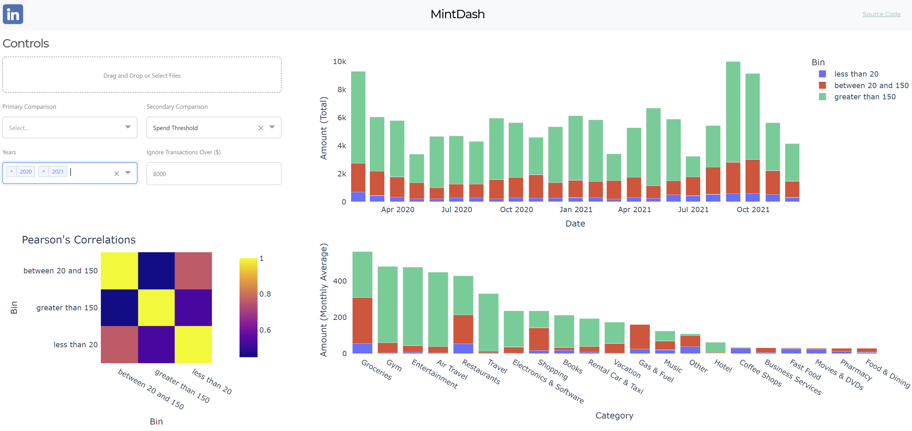

# MintDash
a minty dashboard!



```
git clone https://github.com/wesleybeckner/mintdash.git
cd mintdash
pip install -r requirements.txt
python wsgi.py
```

## Notes

If you want the configuration settings to set properly you will need to create a local `.env` file with the parameters referenced in `config.py`

For a full reference on how Flask and Dash are setup visit [Todds article](https://hackersandslackers.com/plotly-dash-with-flask/)